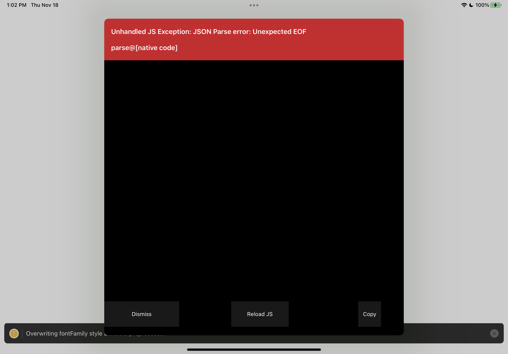

# Expo-GL MVP

This small reproduction aims to address the issue titled _[expo-gl Unhandled JS Exception: JSON Parse error: Unexpected EOF parse@[native code]](https://github.com/expo/expo/issues/14919)_

Notably, it is an ejected expo project, running on RN 0.66 with an expo SDK of 43 or higher (latest at the time of writing).

Tested on iOS, running on a real device.

